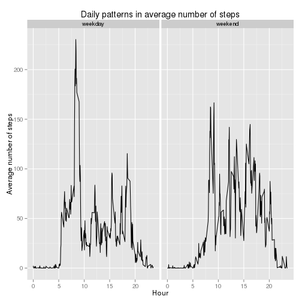

Data available on: https://github.com/rdpeng/RepData_PeerAssessment1 (filename activity.zip)

## Load and preprocess the data

1. Load the data (after unzipping the archive):


```r
a<-read.csv("activity.csv")
```

2. Process/transform the data (if necessary) into a format suitable for your analysis


```r
#I didn't find transformations necessary for this task
```

## What is mean total number of steps taken per day?

For this part of the assignment, you can ignore the missing values in the dataset.

1. Calculate the total number of steps taken per day


```r
totalstepsperday<-aggregate(a$steps,by=list(a$date),sum,na.rm=TRUE)
```

2. Make a histogram of the total number of steps taken each day


```r
hist(totalstepsperday$x,main='Total number of steps taken each day',xlab='Steps per day')
```

 

3. Calculate and report the mean and median of the total number of steps taken per day


```r
mean_steps_per_day<-format(mean(totalstepsperday$x,na.rm=TRUE),digits=2)
median_steps_per_day<-format(median(totalstepsperday$x,na.rm=TRUE),digits=2)
```

Ignoring missing values, the mean and median number of steps per day are 9354 and 10395

## What is the average daily activity pattern?

1. Make a time series plot of the 5-minute interval (x-axis) and the average number of steps taken, averaged across all days (y-axis)


```r
meanstepsperinterval<-aggregate(a$steps,by=list(a$interval),mean,na.rm=TRUE)
plot(meanstepsperinterval[,1]/100,meanstepsperinterval$x,type='l',main='Daily pattern of average number of steps',xlab='Time of the day',ylab='Average number of steps')
```

 

2. Which 5-minute interval, on average across all the days in the dataset, contains the maximum number of steps?


```r
intmax<-meanstepsperinterval[which.max(meanstepsperinterval$x),1]
timemax<-paste(as.character(intmax%/%100),':',as.character(round(intmax%%100)),sep='')
```

Maximum number of steps occurs in a five-minutes interval starting at 8:35.

## Imputing missing values

Note that there are a number of days/intervals where there are missing values (coded as NA). The presence of missing days may introduce bias into some calculations or summaries of the data.

1. Calculate and report the total number of missing values in the dataset (i.e. the total number of rows with NAs)


```r
nans<-sum(is.na(a$steps))
```

Total number of missing values is 2304

2. Devise a strategy for filling in all of the missing values in the dataset. The strategy does not need to be sophisticated. For example, you could use the mean/median for that day, or the mean for that 5-minute interval, etc.


```r
#replace missing values with the mean for that interval
#over all days
## (attempted to scale it by the mean of that day
##over the grand mean over all days and intervals
##but too much trouble
```

3. Create a new dataset that is equal to the original dataset but with the missing data filled in.


```r
filled_a<-a
for(i in 1:dim(a)[1]){
  if(is.na(a$steps[i])){
  filled_a$steps[i]<-mean(a$steps[a$interval==a$interval[i]],na.rm=TRUE)
  #*mean(a$steps[a$date==a$date[i]],na.rm=TRUE)/mean(meanstepsperinterval$x,na.rm=TRUE)
  }
}
```

4. Make a histogram of the total number of steps taken each day and Calculate and report the mean and median total number of steps taken per day. Do these values differ from the estimates from the first part of the assignment? What is the impact of imputing missing data on the estimates of the total daily number of steps?


```r
totalstepsperday_filled<-aggregate(filled_a$steps,by=list(a$date),sum)
hist(totalstepsperday_filled$x,main='Total number of steps taken each day, missing data imputed',xlab='Steps per day')
```

 

```r
mean_steps_per_day_filled<-format(mean(totalstepsperday_filled$x,na.rm=TRUE),digits=2)
median_steps_per_day_filled<-format(median(totalstepsperday_filled$x,na.rm=TRUE),digits=2)
```

With imputed missing values, the mean and median number of steps per day are 10766 and 10766. The distribution appear much less skewed than when missing values are ignored.

##Are there differences in activity patterns between weekdays and weekends?

For this part the weekdays() function may be of some help here. Use the dataset with the filled-in missing values for this part.

1. Create a new factor variable in the dataset with two levels – “weekday” and “weekend” indicating whether a given date is a weekday or weekend day.


```r
weekday<-weekdays(as.Date(filled_a$date))
filled_a$weekday<-rep("weekday",dim(filled_a)[1])
filled_a$weekday[weekday %in% c("Saturday","Sunday")]<-"weekend"
```

2. Make a panel plot containing a time series plot (i.e. type = "l") of the 5-minute interval (x-axis) and the average number of steps taken, averaged across all weekday days or weekend days (y-axis). See the README file in the GitHub repository to see an example of what this plot should look like using simulated data.


```r
library(ggplot2)
meanstepsperinterval_filled<-aggregate(filled_a$steps,by=list(filled_a$interval,filled_a$weekday),mean)
names(meanstepsperinterval_filled)=c("interval","weekday","steps")
qplot(data=meanstepsperinterval_filled,interval/100,steps,geom=c("line"),facets=.~weekday,main="Daily patterns in average number of steps",xlab="Hour",ylab="Average number of steps")
```

 

The average number of steps has a sharp spike in the morning and lower spikes around lunchtime and in early and late evening, while at weekend it is more uniformly distributed at all hours.


```r
total<-aggregate(filled_a$steps,by=list(filled_a$weekday),sum)
avg_wkday=total[1,2]/5
avg_wkend=total[2,2]/2
```

